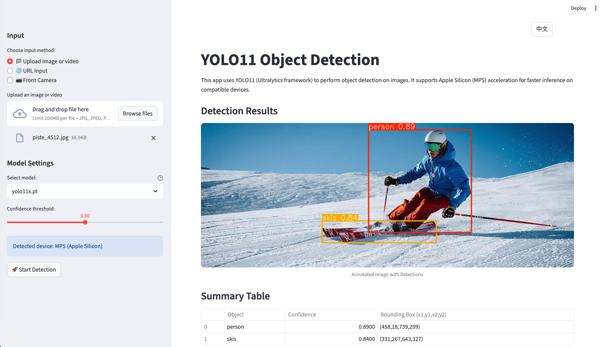

[English](README.md) | [中文](_README_CN.md)

# YOLO11 Object Detection Streamlit App

A comprehensive Streamlit web application for object detection on images, videos, and live camera feeds using YOLO11 from the Ultralytics framework, with support for cloud-based AI models.



## Live Demo

https://yolo-live.streamlit.app/

## Features

- **Multi-Input Support**: Upload images or videos, provide image URLs, or use live camera capture
- **Front Camera Integration**: Capture photos directly from your device's front camera using Streamlit's camera widget
- **Multi-Model Architecture**:
  - Local YOLO11 models (n, s, m, l, x) with different sizes and performances
  - Qwen-Image-Edit via DashScope API for cloud-based annotated image generation
  - Gemini 2.5 Flash Image via OpenRouter API for advanced image processing
- **Adjustable Confidence Threshold**: Fine-tune detection sensitivity with a slider
- **Automatic Device Detection**: Utilizes MPS acceleration on Apple Silicon devices, falls back to CPU
- **Image Processing**: Display annotated images with bounding boxes and labels, summary table of detected objects, and rotation controls
- **Video Processing**: Process videos with real-time progress updates, display annotated output videos
- **Camera Detection**: Real-time object detection on captured photos from front camera
- **Download Results**: Save annotated images or videos locally
- **Session Management**: Maintains state for current inputs, camera frames, and results
- **API Integration**: Session-only API key storage for cloud models
- **Bilingual Interface**: Full English/Chinese language support with persistent input method selection
- **Smart UI Management**: Input image automatically hidden after successful detection for cleaner results display

## Setup

### Prerequisites

- Python 3.12 or higher
- uv package manager (recommended) or pip

### Installation

1. Clone or download the project:
   
   ```bash
   git clone <repository-url>
   cd YOLO_app
   ```

2. Install dependencies using uv (recommended):
   
   ```bash
   uv sync
   ```
   
   Or using pip:
   
   ```bash
   pip install -e .
   ```

3. For Apple Silicon users, ensure PyTorch with MPS support is installed (included in dependencies).

4. For camera functionality, ensure your device has a working front camera and browser permissions are enabled.

5. For cloud models, obtain API keys:
   
   - **Qwen-Image-Edit**: DashScope API key from Alibaba Cloud
   - **Gemini 2.5 Flash Image**: OpenRouter API key

## Usage

Run the Streamlit app:

```bash
streamlit run app.py
```

Open the URL provided by Streamlit in your browser (typically http://localhost:8501).

### Language Support

The application features full bilingual support:

- **Language Switcher**: Toggle between EN (English) and 中文 (Chinese) using the button in the top-right corner
- **Persistent Input Method**: Selected input method (Upload/URL/Camera) is preserved when switching languages
- **Translated Interface**: All UI elements, messages, and documentation are fully translated
- **Consistent Experience**: Language preference is maintained throughout the session

### Smart Interface Features

- **Input Image Hiding**: After successful detection, the input image section is automatically hidden to focus on results
- **Conditional Controls**: Rotation buttons and input image controls appear only when no detection results exist
- **Clean Results Display**: Focuses on annotated detection results without UI clutter
- **Automatic Reset**: Input image section reappears when uploading new images or rotating existing ones

### Model Options

**Local YOLO Models:**

- `yolo11n.pt`: Nano - Fastest, good for real-time applications
- `yolo11s.pt`: Small - Balanced speed and accuracy
- `yolo11m.pt`: Medium - Good accuracy for most use cases
- `yolo11l.pt`: Large - High accuracy, slower processing
- `yolo11x.pt`: Extra Large - Highest accuracy, slowest processing

**Cloud Models (Images Only):**

- **Qwen-Image-Edit**: Generates annotated images with bounding boxes via DashScope API
- **Gemini 2.5 Flash Image**: Advanced image processing with dual modality support via OpenRouter API

### Input Methods

**📁 Upload Image or Video:**

- Select this option to upload files from your device
- Supported formats: JPG, JPEG, PNG (images), MP4, AVI, MOV, MKV (videos)

**🌐 URL Input:**

- Enter an image URL to load and detect objects directly from the web

**📷 Front Camera:**

- Capture photos directly from your device's front camera
- Take a photo, then click "🚀 Start Detection" to run detection

### Workflow

1. Choose your input method (Upload, URL, or Camera)
2. Select model and adjust confidence threshold
3. For cloud models, configure API keys in the sidebar
4. Upload file/enter URL/take photo
5. Click "🚀 Start Detection" to run object detection
6. View detections with annotated visuals and summary data
7. Download processed results if desired

**Additional Features:**

- **Language Toggle**: Switch between English and Chinese using the EN/中文 button
- **Image Editing**: Rotate images before detection using ↻ ↺ buttons
- **Smart Display**: Input image automatically hides after successful detection for cleaner results view

### API Configuration

**For Qwen-Image-Edit:**

1. Obtain DashScope API key from Alibaba Cloud console
2. Enter the key in the sidebar when Qwen-Image-Edit is selected
3. The key is stored only for the current session

**For Gemini 2.5 Flash Image:**

1. Obtain OpenRouter API key from OpenRouter dashboard
2. Enter the key in the sidebar when Gemini 2.5 Flash Image is selected
3. The key is stored only for the current session

## Dependencies

**Core Libraries:**

- `streamlit`: Web app framework
- `ultralytics`: YOLO model library
- `torch`: Machine learning framework with MPS support
- `pillow`: Image processing
- `opencv-python`: Computer vision
- `numpy`: Numerical computing

**Cloud Integrations:**

- `dashscope`: Qwen-Image-Edit API integration (optional)
- `requests`: HTTP client for API calls
- `base64`: Image encoding for cloud APIs
