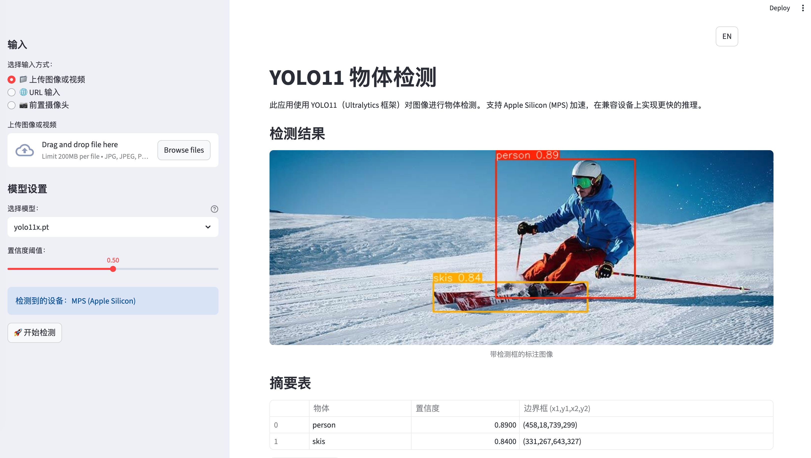

[English](README.md) | [中文](_README_CN.md)

# YOLO11 物体检测 Streamlit 应用程序

一个基于 Streamlit 的综合 Web 应用程序，使用 Ultralytics 框架的 YOLO11 对图像、视频和实时摄像头输入进行物体检测，支持基于云端的 AI 模型。



## 在线演示

https://YOLO-app.streamlit.app/

## 功能特性

- **多输入支持**: 上传图像或视频、提供图像 URL 或使用实时摄像头捕获
- **前置摄像头集成**: 使用 Streamlit 的摄像头组件直接从设备的前置摄像头捕获照片
- **多模型架构**:
  - 本地 YOLO11 模型 (n, s, m, l, x) 具有不同的尺寸和性能
  - 通过 DashScope API 的 Qwen-Image-Edit 进行云端带注释图像生成
  - 通过 OpenRouter API 的 Gemini 2.5 Flash Image 进行高级图像处理
- **可调节置信度阈值**: 使用滑块微调检测灵敏度
- **自动设备检测**: 在 Apple Silicon 设备上利用 MPS 加速，回退到 CPU
- **图像处理**: 显示带边界框和标签的注释图像、检测对象摘要表和旋转控制
- **视频处理**: 处理视频并实时显示进度更新，显示注释输出视频
- **摄像头检测**: 对前置摄像头捕获的照片进行实时物体检测
- **下载结果**: 本地保存注释图像或视频
- **会话管理**: 维护当前输入、摄像头帧和结果的状态
- **API 集成**: 云模型的会话级 API 密钥存储
- **双语界面**: 完整的英文/中文语言支持，具有持久输入方法选择
- **智能界面管理**: 成功检测后自动隐藏输入图像，提供更清晰的结果显示

## 设置

### 先决条件

- Python 3.12 或更高版本
- uv 包管理器（推荐）或 pip

### 安装

1. 克隆或下载项目：
   
   ```bash
   git clone <repository-url>
   cd YOLO_app
   ```

2. 使用 uv 安装依赖（推荐）：
   
   ```bash
   uv sync
   ```
   
   或使用 pip：
   
   ```bash
   pip install -e .
   ```

3. 对于 Apple Silicon 用户，确保安装了支持 MPS 的 PyTorch（包含在依赖项中）。

4. 对于摄像头功能，确保您的设备有可用的前置摄像头并已启用浏览器权限。

5. 对于云模型，获取 API 密钥：
   
   - **Qwen-Image-Edit**: 来自阿里云的 DashScope API 密钥
   - **Gemini 2.5 Flash Image**: OpenRouter API 密钥

## 使用方法

运行 Streamlit 应用：

```bash
streamlit run app.py
```

在浏览器中打开 Streamlit 提供的 URL（通常是 http://localhost:8501）。

### 语言支持

应用程序具有完整的双语支持：

- **语言切换器**: 使用右上角的按钮在 EN (English) 和 中文 之间切换
- **持久输入方法**: 切换语言时保持选择的输入方法（上传/URL/摄像头）
- **翻译界面**: 所有 UI 元素、消息和文档都已完全翻译
- **一致体验**: 在整个会话中保持语言偏好

### 智能界面功能

- **输入图像隐藏**: 成功检测后自动隐藏输入图像部分以专注于结果
- **条件控制**: 旋转按钮和输入图像控件仅在无检测结果时出现
- **清洁结果显示**: 专注于注释检测结果，没有 UI 干扰
- **自动重置**: 上传新图像或旋转现有图像时重新出现输入图像部分

### 模型选项

**本地 YOLO 模型:**

- `yolo11n.pt`: Nano - 最快，适用于实时应用
- `yolo11s.pt`: Small - 平衡速度和准确性
- `yolo11m.pt`: Medium - 适用于大多数用例的良好准确性
- `yolo11l.pt`: Large - 高准确性，处理速度较慢
- `yolo11x.pt`: Extra Large - 最高准确性，处理速度最慢

**云模型（仅图像）:**

- **Qwen-Image-Edit**: 通过 DashScope API 生成带边界框的注释图像
- **Gemini 2.5 Flash Image**: 通过 OpenRouter API 进行具有双模态支持的高级图像处理

### 输入方法

**📁 上传图像或视频:**

- 选择此选项从设备上传文件
- 支持格式：JPG、JPEG、PNG（图像），MP4、AVI、MOV、MKV（视频）

**🌐 URL 输入:**

- 输入图像 URL 以直接从 Web 加载并检测对象

**📷 前置摄像头:**

- 直接从设备的前置摄像头捕获照片
- 拍摄照片，然后点击"🚀 开始检测"运行检测

### 工作流程

1. 选择您的输入方法（上传、URL 或摄像头）
2. 选择模型并调整置信度阈值
3. 对于云模型，在侧边栏中配置 API 密钥
4. 上传文件/输入 URL/拍摄照片
5. 点击"🚀 开始检测"运行物体检测
6. 查看带注释视觉效果和摘要数据的检测结果
7. 如需要，下载处理结果

**附加功能:**

- **语言切换**: 使用 EN/中文 按钮在英文和中文之间切换
- **图像编辑**: 使用 ↻ ↺ 按钮在检测前旋转图像
- **智能显示**: 成功检测后自动隐藏输入图像，提供更清晰的结果视图

### API 配置

**对于 Qwen-Image-Edit:**

1. 从阿里云控制台获取 DashScope API 密钥
2. 选择 Qwen-Image-Edit 时在侧边栏中输入密钥
3. 密钥仅保存在当前会话中

**对于 Gemini 2.5 Flash Image:**

1. 从 OpenRouter 仪表板获取 OpenRouter API 密钥
2. 选择 Gemini 2.5 Flash Image 时在侧边栏中输入密钥
3. 密钥仅保存在当前会话中

## 依赖项

**核心库:**

- `streamlit`: Web 应用框架
- `ultralytics`: YOLO 模型库
- `torch`: 支持 MPS 的机器学习框架
- `pillow`: 图像处理
- `opencv-python`: 计算机视觉
- `numpy`: 数值计算

**云集成:**

- `dashscope`: Qwen-Image-Edit API 集成（可选）
- `requests`: API 调用的 HTTP 客户端
- `base64`: 云 API 的图像编码
